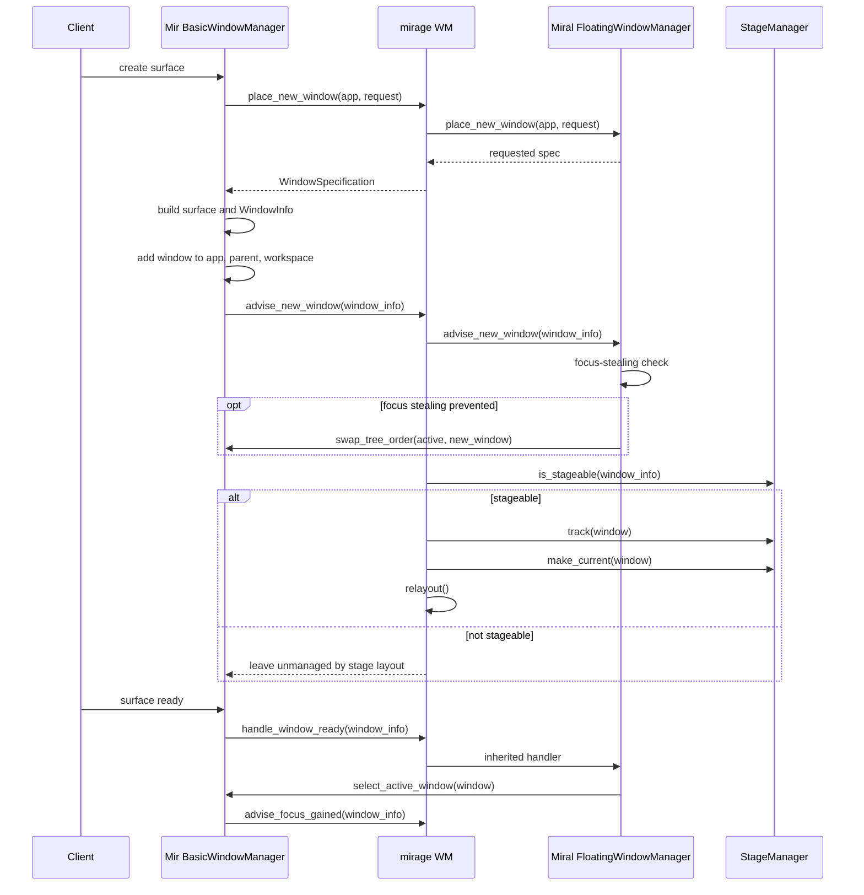
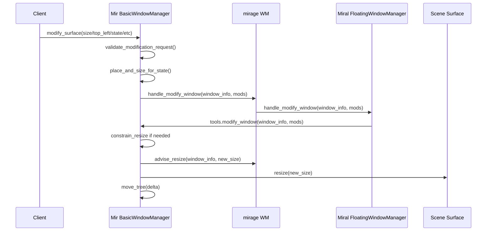
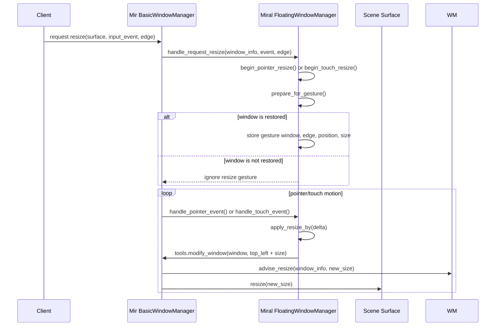
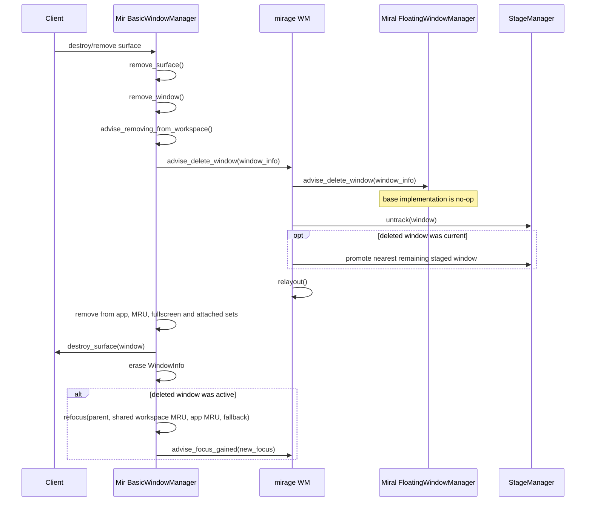
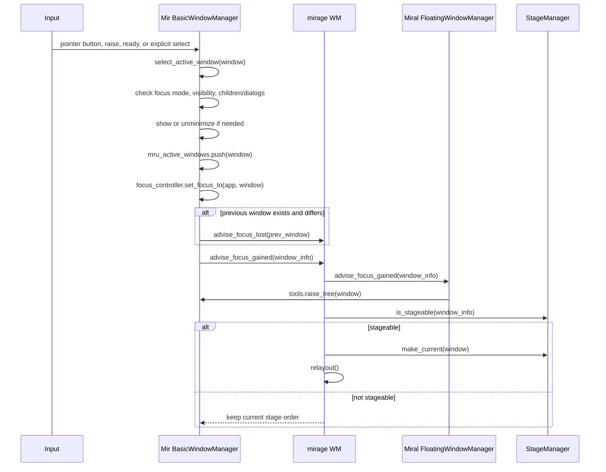

# Stage Management Plan

## Goal

Add macOS-style stage management to `mirage`: one active main window in a large center area, inactive application windows grouped as side stages, keyboard commands to cycle/activate stages, and automatic restaging as windows open, close, focus, or change state.

The first version should prioritize a correct compositor-side state model and deterministic window geometry. Animation, live previews, and a polished shell UI can come later.

## References

- Use [canonical/mir](https://github.com/canonical/mir) to read Mir and Miral source code and behavior.
- Use [Miriway/Miriway](https://github.com/Miriway/Miriway) as the primary reference for compositor policy structure.
- Miriway references worth studying first:
  - [`miriway_policy.h`](https://github.com/Miriway/Miriway/blob/main/miriway_policy.h)
  - [`miriway_policy.cpp`](https://github.com/Miriway/Miriway/blob/main/miriway_policy.cpp)
  - [`miriway_workspace_manager.h`](https://github.com/Miriway/Miriway/blob/main/miriway_workspace_manager.h)
  - [`miriway_workspace_manager.cpp`](https://github.com/Miriway/Miriway/blob/main/miriway_workspace_manager.cpp)
- Mir references worth studying first:
  - [`basic_window_manager.cpp`](https://github.com/canonical/mir/blob/main/src/miral/basic_window_manager.cpp)
  - [`floating_window_manager.cpp`](https://github.com/canonical/mir/blob/main/src/miral/floating_window_manager.cpp)
  - [`floating_window_manager.h`](https://github.com/canonical/mir/blob/main/include/miral/miral/floating_window_manager.h)
  - [`window_management_policy.h`](https://github.com/canonical/mir/blob/main/include/miral/miral/window_management_policy.h)

## Current State

`mirage` currently uses `miral::FloatingWindowManager` with almost no custom window-management behavior. Keybinds support external commands and one internal command, `@exit`.

Relevant local files:

- [`window_manager.h`](https://github.com/phucvinh57/mirage/blob/main/window_manager.h)
- [`window_manager.cc`](https://github.com/phucvinh57/mirage/blob/main/window_manager.cc)
- [`stage_manager.h`](https://github.com/phucvinh57/mirage/blob/main/stage_manager.h)
- [`stage_manager.cc`](https://github.com/phucvinh57/mirage/blob/main/stage_manager.cc)
- [`mirage_keybind.h`](https://github.com/phucvinh57/mirage/blob/main/mirage_keybind.h)
- [`mirage_keybind.cc`](https://github.com/phucvinh57/mirage/blob/main/mirage_keybind.cc)
- [`mirage.cc`](https://github.com/phucvinh57/mirage/blob/main/mirage.cc)
- [`mirage.config`](https://github.com/phucvinh57/mirage/blob/main/mirage.config)

## Implementation Plan

### 1. Define The First Usable Scope

Implement stage management as:

- one active main application window
- inactive normal application windows shown in a side strip
- keyboard commands to toggle stage mode and cycle stages
- automatic relayout on create, delete, focus, raise, and output-zone changes

Defer:

- animations
- thumbnail content previews
- shell panel or dock integration
- per-workspace stage persistence

### 2. Add A Stage Model

Add:

- [`stage_manager.h`](https://github.com/phucvinh57/mirage/blob/main/stage_manager.h)
- [`stage_manager.cc`](https://github.com/phucvinh57/mirage/blob/main/stage_manager.cc)

Track:

- active stage/window
- ordered staged application windows
- per-window restore rectangle
- whether a window is staged, active, hidden, suspended, fullscreen, maximized, or dialog-like

Use Miriway's [`miriway_workspace_manager.h`](https://github.com/Miriway/Miriway/blob/main/miriway_workspace_manager.h) and [`miriway_workspace_manager.cpp`](https://github.com/Miriway/Miriway/blob/main/miriway_workspace_manager.cpp) as references for per-window metadata. In particular, study how `WindowSpecification::userdata()` is initialized in `place_new_window()` and read from `WindowInfo`.

Exclude non-stageable windows:

- dialogs
- menus/popups
- shell surfaces
- fullscreen windows
- non-application depth layers

### 3. Extend `MirageWindowManager`

Keep inheriting from `miral::FloatingWindowManager` initially.

Override these policy hooks:

- `place_new_window()`
- `advise_new_window()`
- `advise_delete_window()`
- `advise_focus_gained()`
- `handle_raise_window()`
- `handle_modify_window()`
- `advise_application_zone_create()`
- `advise_application_zone_update()`
- `advise_application_zone_delete()`

Use Miral APIs from `WindowManagerTools`:

- `active_window()`
- `select_active_window()`
- `raise_tree()`
- `send_tree_to_back()`
- `modify_window()`
- `place_and_size_for_state()`
- `active_application_zone()`

Follow Miriway's convention of doing model mutations under the Miral window-management lock. Policy hook calls already hold the lock; commands coming from outside policy hooks should use `tools.invoke_under_lock()`.

### 4. Implement Deterministic Layout

Compute layout from `tools.active_application_zone().extents()`.

Initial layout:

- main area centered in the application zone
- main window about 70-78% of usable width and 84-90% of usable height
- left side strip with fixed width, around 160-220 px depending on output size
- inactive stages vertically stacked in the side strip

Apply layout with `miral::WindowSpecification`:

- `top_left()`
- `size()`
- `state() = mir_window_state_restored`

Preserve restore geometry before first staging so stage mode can be disabled without losing previous floating placement.

### 5. Add Internal Commands

Extend internal keybind handling so actions can call the window manager, not only the runner.

Add a small command bridge, similar in spirit to Miriway's `ShellCommands`, but much smaller:

- `MirageCommands`
- shared by [`mirage.cc`](https://github.com/phucvinh57/mirage/blob/main/mirage.cc), `KeybindConfig`, and `MirageWindowManager`

Initial internal commands:

- `@stage-toggle`
- `@stage-next`
- `@stage-prev`
- `@stage-focus-main`
- `@stage-cycle`

Possible later commands:

- `@stage-add-window`
- `@stage-remove-window`
- `@stage-disable-for-window`

### 6. Wire Default Keybinds

Update [`mirage.config`](https://github.com/phucvinh57/mirage/blob/main/mirage.config) with defaults such as:

```ini
command_meta=Tab:@stage-next
command_meta_shift=Tab:@stage-prev
command_meta=s:@stage-toggle
```

Keep existing external app launch behavior unchanged.

### 7. Handle Window Lifecycle

On new normal application window:

- add it to the stage list
- make it active by default, or add it as inactive depending on a future config option
- relayout

On delete:

- remove it from the stage list
- if it was active, promote the nearest remaining staged window
- relayout

On focus or raise request:

- activate the stage containing that window
- raise it
- relayout

On fullscreen or maximize:

- suspend that window from stage layout
- let the base floating policy handle the requested state

On restored state:

- reinsert the window into stage layout if stage mode is enabled

### Window Lifecycle Execution Order

These flows describe the current Miral execution order, with the planned `StageManager` mutations shown as the stage-management extension points. The current `StageManager::is_stageable()` stub returns `false`, so the stage-specific branches become active only after the stage model is implemented.

#### New Window Open



#### Resize Window

Client-requested resize or modification:



Interactive pointer or touch resize:



#### Window Delete



#### Window Focus



### 8. Multi-Output Behavior

First pass:

- stage only within the active application zone
- relayout using `active_application_zone()`

Second pass:

- track `application_zones`, following Miriway's [`miriway_policy.cpp`](https://github.com/Miriway/Miriway/blob/main/miriway_policy.cpp)
- maintain separate stage sets per zone/output
- assign windows by center point or output id

### 9. Optional Workspace Integration

Do not start with Miriway-style dynamic workspaces.

If stage groups later need stronger isolation, reuse the Miriway workspace pattern:

- `tools.create_workspace()`
- `tools.add_tree_to_workspace()`
- `tools.remove_tree_from_workspace()`
- `tools.for_each_window_in_workspace()`
- hide inactive groups with `mir_window_state_hidden`

For the first stage-management version, geometry plus focus order is simpler than workspace-backed groups.

### 10. Testing And Verification

Add focused unit tests if the project gains a test target. Until then, verify manually:

- one window fills the main stage
- two windows produce one main window and one side-stage window
- many windows cycle predictably
- closing the active window promotes another window
- dialogs remain associated with their parent and are not staged independently
- fullscreen apps bypass stage layout
- maximized/restored windows behave predictably
- output resize triggers relayout
- keybind commands reach the window manager

Build after each milestone with CMake.

Run nested where possible and test with:

- `ptyxis`
- simple Wayland applications
- Xwayland applications

## Suggested Milestones

1. Add stage manager data model and layout calculator without live window mutation.
2. Apply live relayout of normal windows on create, delete, and focus.
3. Add internal keybind commands.
4. Handle fullscreen, dialogs, maximize, restore, and output changes robustly.
5. Add optional visual shell component for thumbnails or previews.
